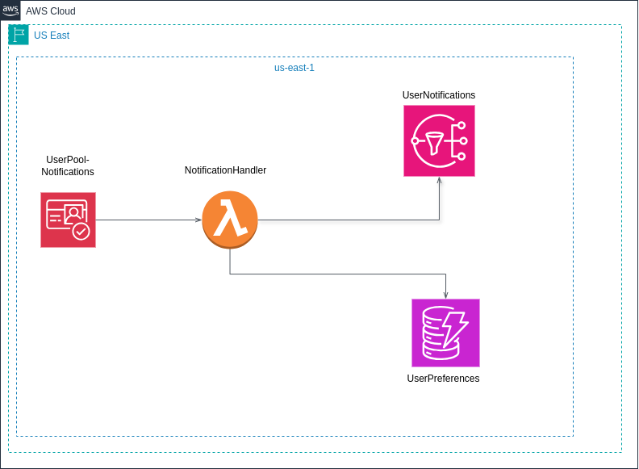
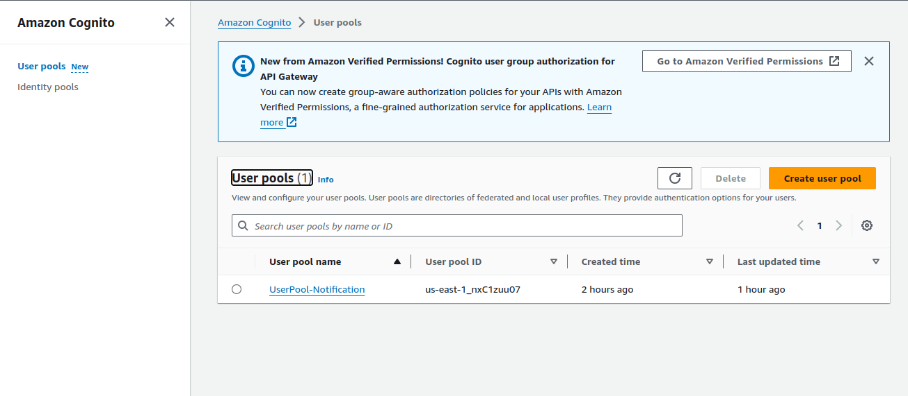
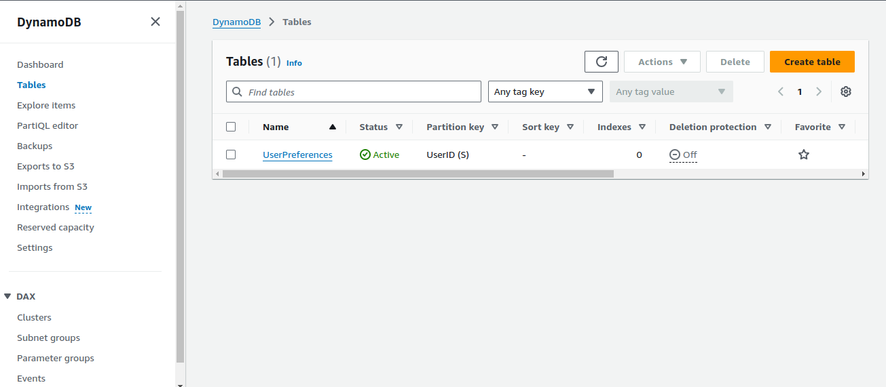
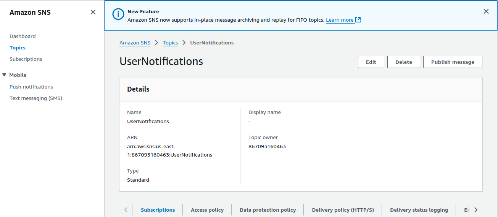
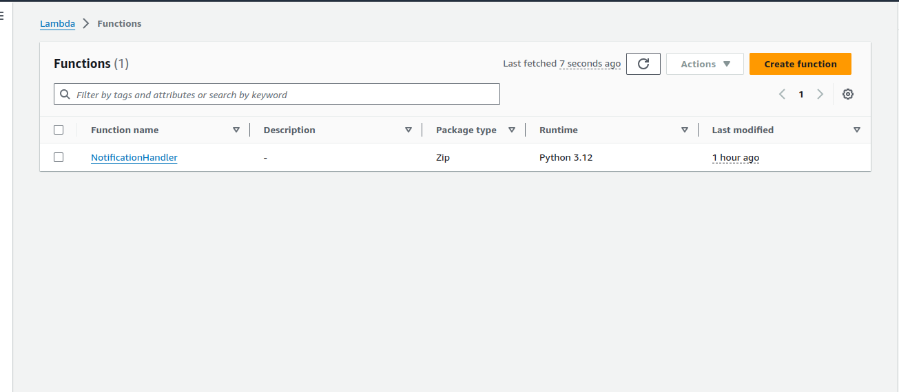

# Building My Cloud-Based User Registration and Notification System

## Project Overview

I set out to build a cloud-based system for user registration and notifications using various AWS services. My goal was to automate the user sign-up process, verify email addresses, store data in DynamoDB, and send notifications via Amazon SNS. I wanted the system to offer a seamless experience while ensuring secure, scalable data management. This project challenged my skills and taught me valuable lessons along the way.

## Architecture

I designed the architecture to include:

- **AWS Cognito** for user authentication.
- **AWS Lambda** to handle user registration logic.
- **DynamoDB** for storing user information.
- **Amazon SNS** for sending email notifications.

Here’s a simple diagram of the architecture I followed:  

## Setup Instructions

I broke the setup into several key steps, each presenting its unique challenge.

### Step 1: Creating a Cognito User Pool

I started by navigating to the AWS Cognito console and creating a user pool. I configured it to require both an email and a username for sign-in, and enabled email verification. One challenge I encountered here was ensuring the user pool settings were correctly configured—particularly with verification. I realized that a small oversight could cause issues later, so I had to be thorough in checking every configuration option.

### Step 2: Setting Up DynamoDB

Next, I created a DynamoDB table for storing user data. I named it "UserPreferences" and used the **UserID** as the primary key. Here, I initially struggled with designing an efficient table schema, but I focused on keeping the structure simple for this MVP (Minimum Viable Product).

### Step 3: Configuring SNS

I then created an SNS topic called "UserNotifications" to send emails. I learned that working with SNS is fairly straightforward, but configuring permissions for Lambda to interact with SNS correctly was something I had to troubleshoot a couple of times.

### Step 4: Lambda Function Creation

I created a Lambda function called "NotificationHandler" using Python as the runtime. Writing the logic to store user details in DynamoDB and trigger SNS notifications required several iterations, especially when I first faced some permission errors when Lambda tried accessing DynamoDB. After trial and error, I solved it by updating the execution role with the correct policies.

## Functionality

Once everything was set up, I tested the system to ensure it worked as expected:

- **User Registration:** Users could register with their email and username.
- **Email Verification:** They received a verification code, and after confirming it, their details were stored in DynamoDB.
- **Notification:** A welcome email was sent via SNS once the account was created.

## AWS Services Used

I leveraged several AWS services to bring this system to life:

- **AWS Cognito** for user authentication and management.
- **AWS Lambda** to execute backend logic.
- **DynamoDB** for data storage.
- **Amazon SNS** to handle email notifications.

## Challenges and Solutions

- **Setting Permissions:** One of the most frustrating aspects was figuring out why my Lambda function wasn’t able to publish to SNS or write to DynamoDB. After combing through the documentation and some trial and error, I discovered I hadn’t assigned sufficient permissions. Once I attached the necessary policies (like AmazonSNSFullAccess and a custom LambdaDynamoDBWritePolicy), it worked like a charm.

- **Handling Event Errors:** When subscribing users to the SNS topic, I faced an issue where subscriptions were not created for certain emails due to invalid addresses. I enhanced error logging to better handle this scenario and ensured that invalid emails wouldn’t halt the entire process.

- **Testing:** Testing was a crucial step that revealed multiple bugs, such as notifications not triggering properly or data not being stored in DynamoDB. AWS CloudWatch logs were incredibly useful here for debugging Lambda functions. I highly recommend enabling detailed logging from the start.

## Future Improvements

Looking back, there are a few enhancements I plan to implement:

- **User Preferences:** I’d like to allow users to choose their notification method, whether by email, SMS, or even push notifications.
- **Improved Error Handling:** While the current error handling works, I want to add more robust mechanisms for handling various edge cases, especially during user subscriptions.
- **Analytics:** I’m considering adding analytics to track user engagement with notifications. This would give insights into how users interact with the system and help me improve the user experience.

## Conclusion

This project was a great learning experience. By leveraging AWS services like Lambda, Cognito, DynamoDB, and SNS, I built a scalable, cloud-based solution for user registration and notifications. Although I faced several challenges, they allowed me to deepen my understanding of AWS, and I’m proud of the system I created.

